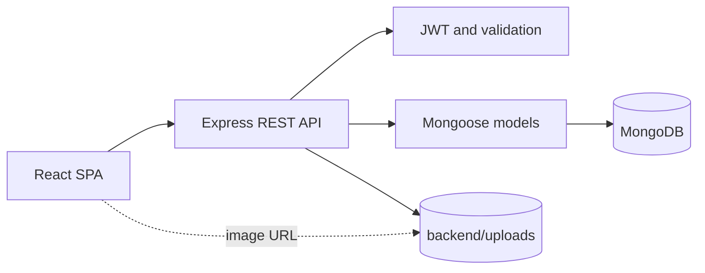
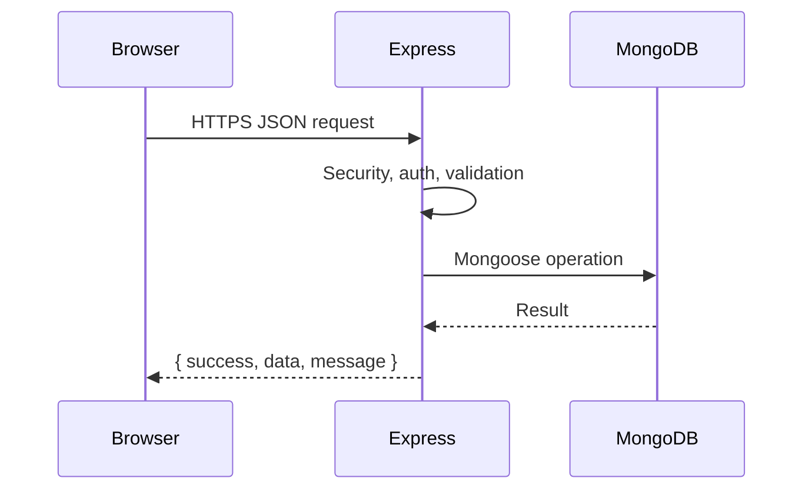
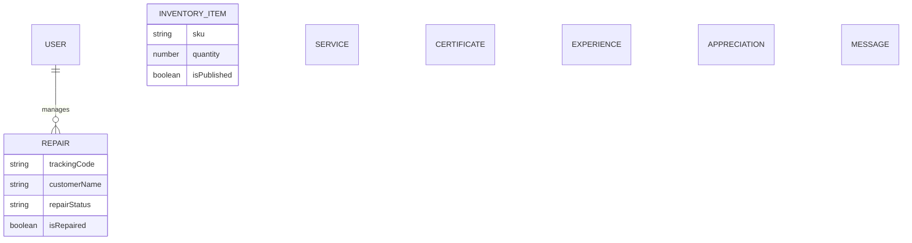
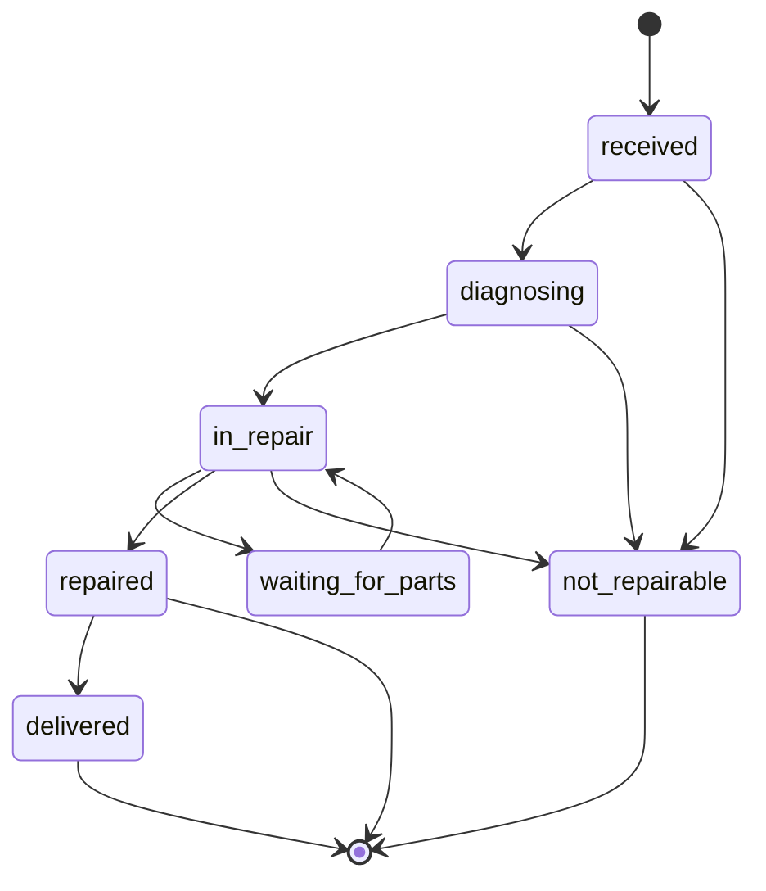

# Architecture

```mermaid
flowchart LR
Browser[React SPA] --> API[Express REST API]
API --> Auth[JWT and validation]
API --> Models[Mongoose models]
Models --> Mongo[(MongoDB)]
API --> Uploads[(backend/uploads)]
Browser -. image URL .-> Uploads
```

```mermaid
sequenceDiagram
  participant Browser
  participant Express
  participant MongoDB
  Browser->>Express: HTTPS JSON request
  Express->>Express: Security, auth, validation
  Express->>MongoDB: Mongoose operation
  MongoDB-->>Express: Result
  Express-->>Browser: { success, data, message }
```

```mermaid
erDiagram
  USER ||--o{ REPAIR : manages
  REPAIR {
    string trackingCode
    string customerName
    string repairStatus
    boolean isRepaired
  }
  INVENTORY_ITEM {
    string sku
    number quantity
    boolean isPublished
  }
  SERVICE {}
  CERTIFICATE {}
  EXPERIENCE {}
  APPRECIATION {}
  MESSAGE {}
```

```mermaid
stateDiagram-v2
  [*] --> received
  received --> diagnosing
  diagnosing --> in_repair
  in_repair --> waiting_for_parts
  waiting_for_parts --> in_repair
  in_repair --> repaired
  repaired --> delivered
  received --> not_repairable
  diagnosing --> not_repairable
  in_repair --> not_repairable
  repaired --> [*]
  delivered --> [*]
  not_repairable --> [*]
```
